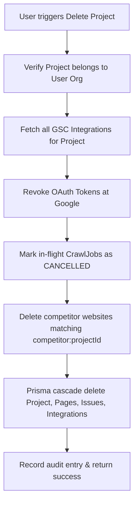
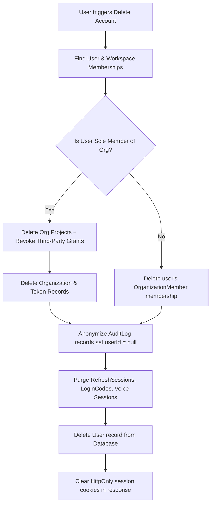

# Account & Data Deletion Architecture

## 1. Overview
In compliance with GDPR (Right to Erasure / Article 17), CCPA, and modern privacy standards, Reigel provides automated and complete data erasure mechanisms for users and projects.

Both self-serve UI controls and programmatic REST endpoints are available:
- **Project Deletion**: `DELETE /projects/:id`
- **Account Erasure**: `DELETE /auth/account`

---

## 2. Project Deletion Lifecycle

When a project is deleted via `ProjectsService.deleteProject(projectId, organizationId)`:

### Steps Executed:
1. **Authorization Check**: Confirms the project belongs to the caller's active organization.
2. **Third-Party Revocation**: Fetches all `GscIntegration` records, decrypts the Google refresh tokens, and submits an HTTP POST to `https://oauth2.googleapis.com/revoke` to ensure Google terminates grant permissions immediately.
3. **In-Flight Jobs Cancellation**: Updates any `PENDING` or `RUNNING` crawl jobs to `CANCELLED` so worker threads cleanly abort processing.
4. **Scoped Competitor Clean-up**: Queries and deletes all `Website` entities scoped with `competitor:<projectId>`.
5. **Database Deletion**: Executes Prisma delete, cascading removal of crawl jobs, crawled pages, technical issues, keywords, and integration records.

---

## 3. User Account Erasure Lifecycle

When an account is deleted via `UsersService.deleteAccount(userId)` / `DELETE /auth/account`:

### Key Technical Guarantees:
1. **Zero Orphaned Grants**: Solitary organizations owned solely by the user have all their Google Search Console tokens revoked upstream before database records are dropped.
2. **Preservation of Audit Compliance**: In financial and compliance audits, workspace action trails must remain unbroken. Reigel anonymizes all `AuditLog` entries by detaching the user (`userId = null`) rather than deleting organizational log history, satisfying both GDPR erasure and corporate accountability requirements.
3. **Multi-Tenant Safety**: If the user belongs to an organization with other team members, the organization remains intact while the user's membership and personal access rights are severed.
4. **Immediate Session Termination**: All active `RefreshSession` records are deleted, and response headers set empty, expired cookies (`auth_token`, `refresh_token`, `csrf_token`).

---

## 4. UI Implementation
- Available under **Settings → Privacy & Data** (`/settings?tab=privacy`).
- Enforces explicit user confirmation modals before initiating destruction.
