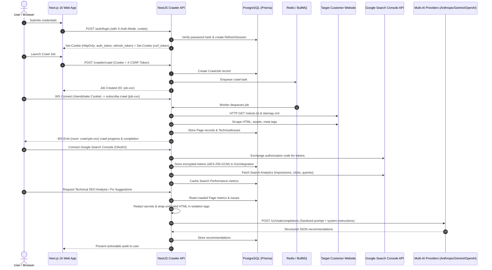

# Architecture Data Flow Diagram & Specifications

## 1. Overview
This document traces end-to-end data transmission across the Reigel/GrowthX architecture:
1. Browser client interactions (HTTP & WebSockets).
2. Crawler worker pipeline and external page extraction.
3. Third-party integrations (Google Search Console, GitHub).
4. AI Provider synthesis (Multi-AI Router).

---

## 2. Data Flow Architecture

---

## 3. Data Flow Boundaries & Trust Zones

### 3.1 Zone 1: Client to API (Public Internet)
- **Protocol**: HTTPS (TLS 1.3) / WSS (Secure WebSockets).
- **Security Controls**:
  - CSRF Origin check and Double-Submit cookie verification.
  - HttpOnly, SameSite=Lax/Strict session cookies with path scoping (`/auth`).
  - Strict WebSocket handshake JWT authentication; client subscription restricted to verified organization/project rooms.
  - Security headers enforced via `helmet` and Next.js `headers()`.

### 3.2 Zone 2: Backend Core (Internal VPC / Process Space)
- **Components**: NestJS API, PostgreSQL, Redis.
- **Security Controls**:
  - Parameterized queries via Prisma ORM (SQL injection prevention).
  - AES-256-GCM authenticated encryption for third-party OAuth/PAT tokens.
  - Organization and project tenant isolation enforced on every query.

### 3.3 Zone 3: External Extraction (Outbound Scraping)
- **Components**: Crawler Worker → External Web Servers.
- **Security Controls**:
  - Respect `robots.txt` directives and crawl-delay.
  - Strict URL validation preventing SSRF (Server-Side Request Forgery) against internal metadata/loopback endpoints (`127.0.0.1`, `169.254.169.254`).
  - Max page depth and payload size caps.

### 3.4 Zone 4: Outbound AI Ingestion
- **Components**: Multi-Ai Router → External LLM APIs (OpenAI, Anthropic, Gemini, Mammouth, Sarvam).
- **Security Controls**:
  - Automatic secret scrub via `redactSecretsForAi()` (strips database URIs, API keys, private keys, bearer tokens).
  - External scraped text wrapped in `<UNTRUSTED_CONTENT_*>` delimiters to prevent indirect prompt injection.
  - Zero training on customer prompts based on standard API enterprise terms.
